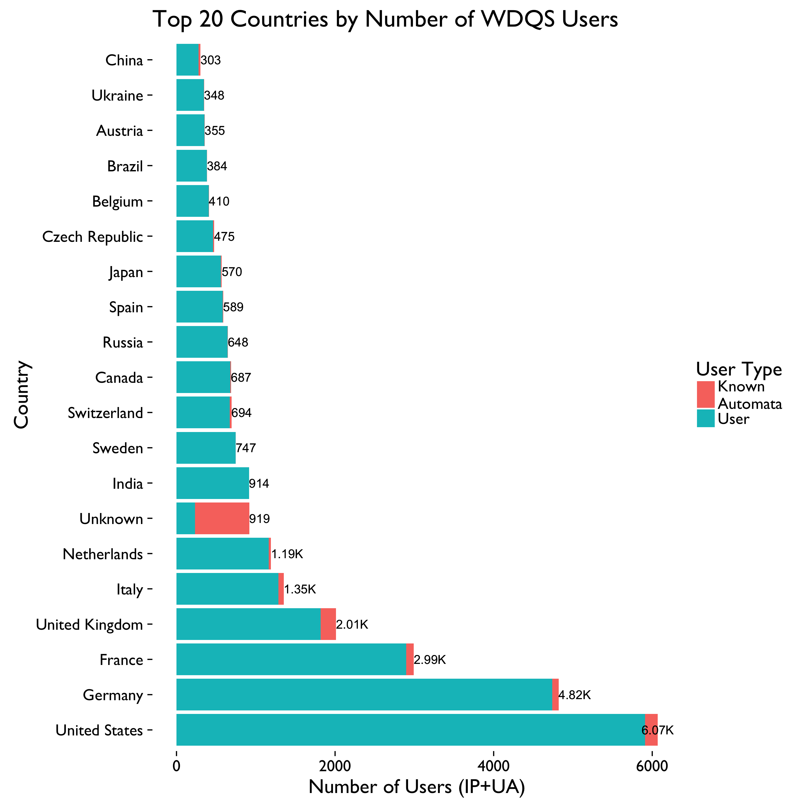
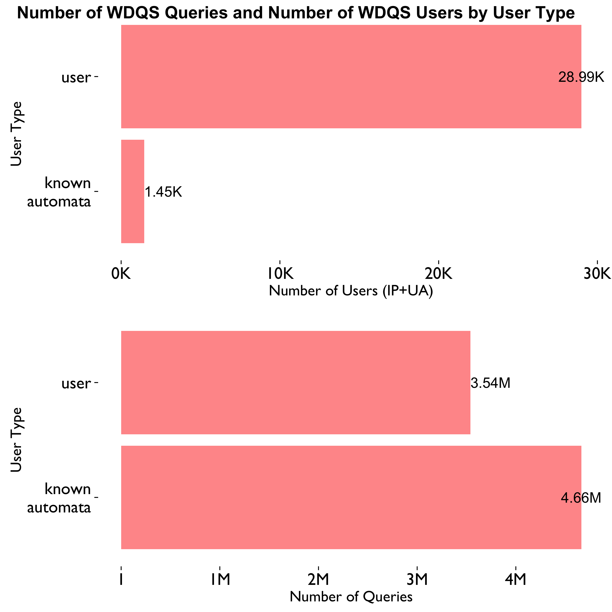
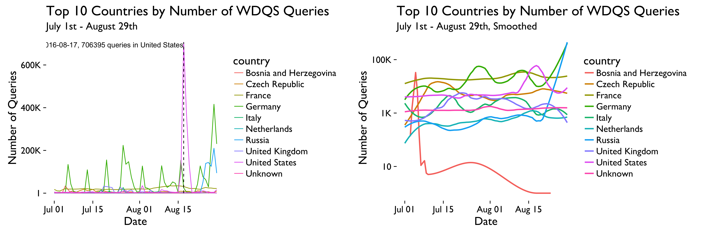
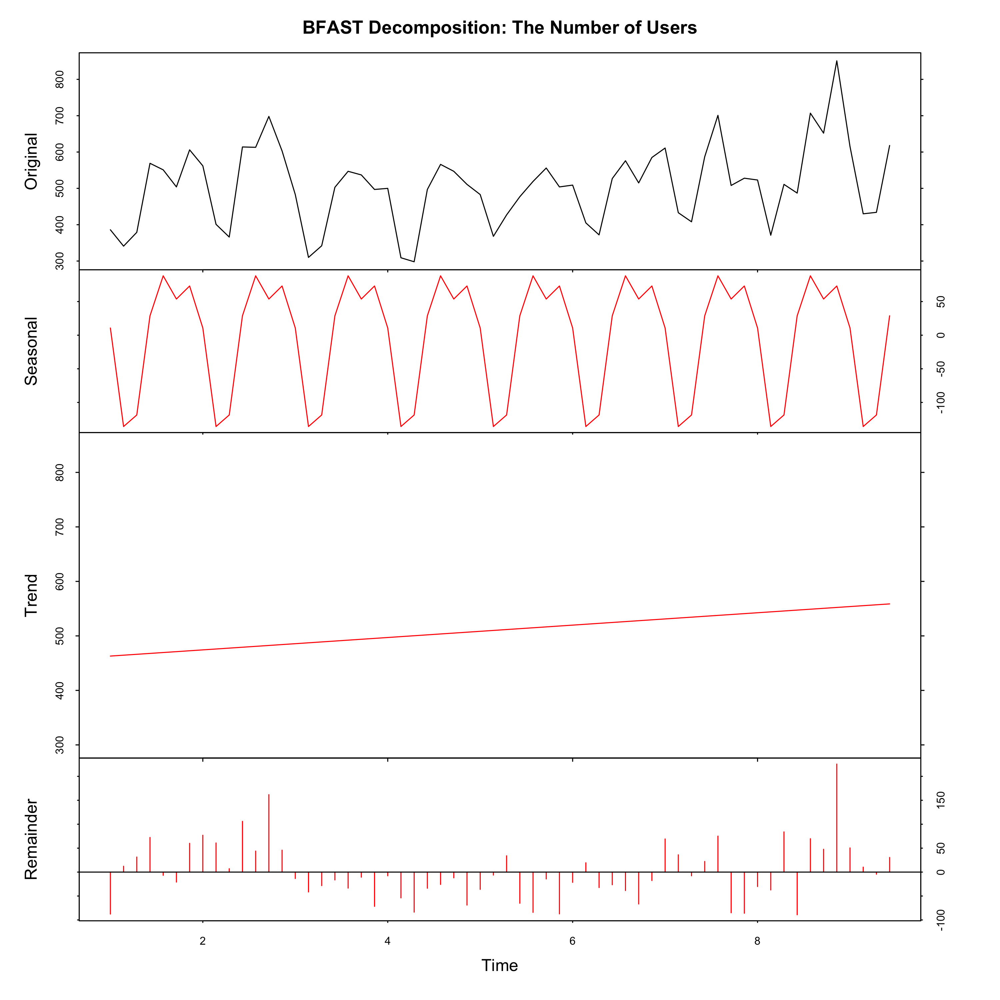
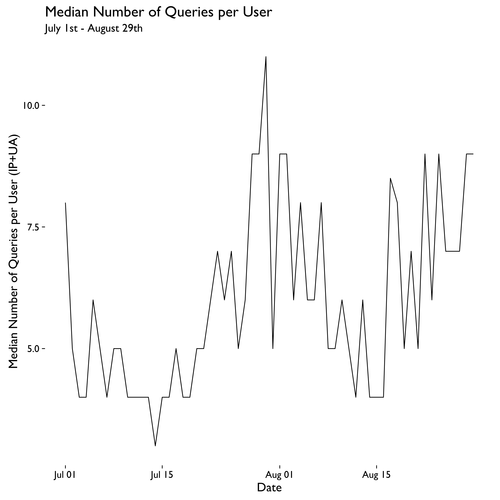

```{r setup, include = FALSE, message = FALSE, warning = FALSE}
knitr::opts_chunk$set(echo = FALSE, message = FALSE, warning = FALSE, fig.pos = 'H')
```

\renewcommand{\abstractname}{Executive Summary}
\begin{abstract}
Wikidata Query Service (WDQS) was launched publicly on September 7, 2015. As the first anniversary is coming up, we want to take a look into who is using WDQS, and how they are using it. In this report, we focus on the web requests to the SPARQL endpoint, their breakdown by country, user agent, referer class, and their pattern over time. 

We found that Germany, United States and France have the largest number of users and queries. Among regular users, Mac OS X and Chrome are most popular, while Ubuntu and Firefox users submit the most queries. Most queries have no referer, followed by those referred from search engine. There are weekly cycles in the number of queries and users. We also saw an increasing trend in the number of users.
\end{abstract}

## Data

Extracting successful (HTTP status codes 200 \& 304) web requests to the SPARQL endpoint from July 1st to August 29, 2016, we count the number of queries and users by country, user agent and referer class. Here the "user" is identified by the combination of client IP and user agent, since different devices, OS's, and browsers on the same network may share the same IP address. However, if users update their browsers and OS's to a newer version in the middle of the day, they would be counted as two users that day. See [data.R](https://github.com/wikimedia-research/Discovery-WDQS-Usage-Explore/blob/master/data.R) for more details.

\newpage

## Results

### Cross-Sectional







### Longitudinal





Next, we excluded the spider queries in US from August 16 to 19 (Figure \ref{eclus}), then implemented BFAST method on the query data. BFAST(Breaks For Additive Season and Trend) integrates the decomposition of time series into trend, season, and remainder components with methods for detecting and characterizing change within time series. First, it decomposes the series into trend and seasonal components with the STL method, then it uses OLS-MOSUM test on each components to see if there is any significant break point. Next, BFAST fits the two components and the detected break points with linear regression. BFAST iteratively estimates the time and number of changes, and characterizes change by its magnitude and direction, until the number and position of the breakpoints are unchanged.







\newpage

## Conclusion/Discussion

In summary, we found that:

- Germany, United States and France have the largest number of users and queries. 
- Among regular users (not known automata), Mac OS X and Chrome are most popular, while Ubuntu and Firefox users submit the most queries. 
- Most queries have no referer, followed by those referred from search engine.
- There are weekly cycles in the number of queries and users. And we also saw an increasing trend in the number of users.

For the next step, more thorough analysis and investigation are needed in order to solve the following questions:

- We saw a large number of spider queries from US on Aug 16-19. Are they from one or several particular spider?
- Is there a significant increasing trend in the number of queries after August 19? Is the increasing trend in the number of users statistically significant?
- If we exclude known automata queries from Germany, could we still see the weekly cycle?
- What could possibly be the reason for the spikes and sharp decrease in the time to first byte pattern?
