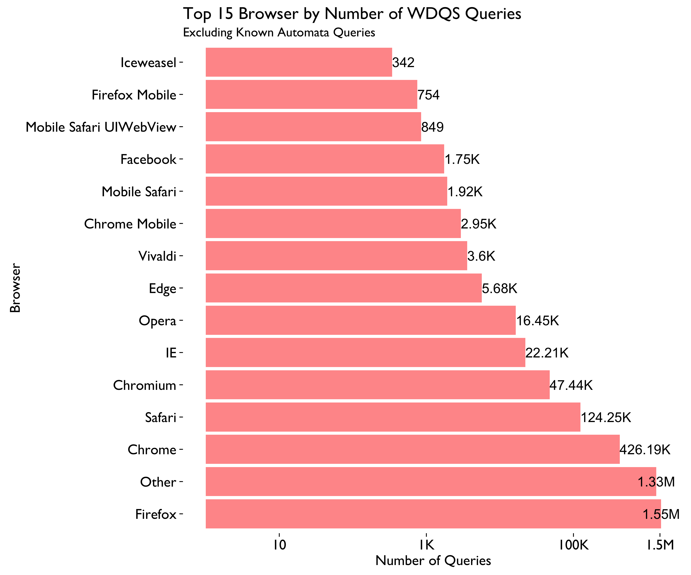
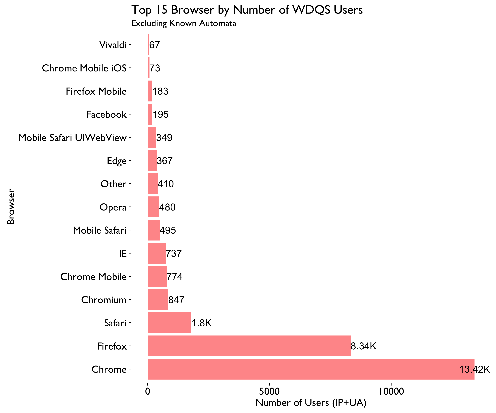
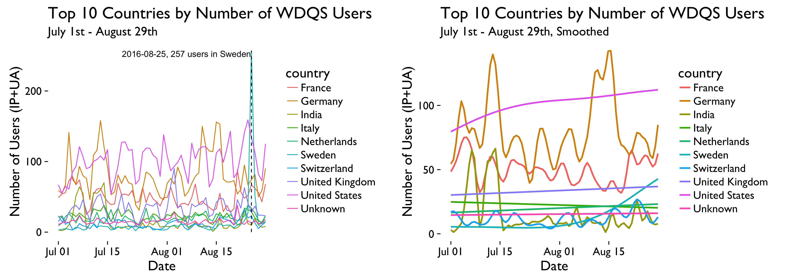
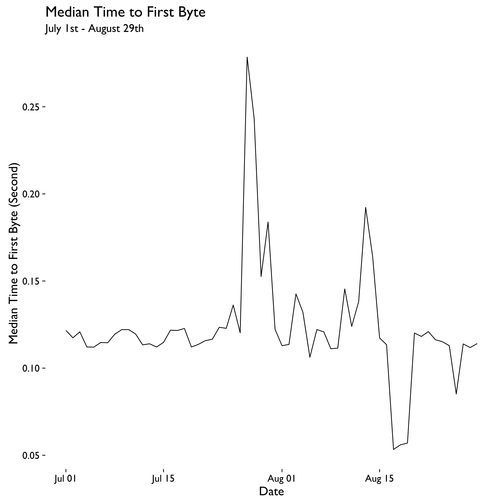

```{r setup, include = FALSE, message = FALSE, warning = FALSE}
knitr::opts_chunk$set(echo = FALSE, message = FALSE, warning = FALSE)
```

\renewcommand{\abstractname}{Executive Summary}
\begin{abstract}
Wikidata Query Service(WDQS) was launched publicly on September 7, 2015. As the first anniversary coming up, we want to take a look into who is using WDQS, and how they are using it. In this report, we focus on the successful (HTTP status codes 200 \& 304) web requests to the SPARQL endpoint, their breakdown by country, user agent, referer class, and their pattern over time.
\end{abstract}

## Data

Extracting successful (HTTP status codes 200 \& 304) web requests to the SPARQL endpoint from July 1st to August 29, 2016, we count the number of queries and users(identified by the combination of client IP and user agent) by country, user agent and referer class. See data.R for more details.

\newpage

## Cross-Sectional







\newpage

## Longitudinal




\newpage

Next, we excluded the spider queries in US from August 16 to 19, then implemented BFAST method on the query data. BFAST(Breaks For Additive Season and Trend) integrates the decomposition of time series into trend, season, and remainder components with methods for detecting and characterizing change within time series. First, it decompose the series into trend and seasonal components with the STL method, then it use OLS-MOSUM test on each components to see if there is any significant break point. Next, BFAST fit the two components and the detected break points with linear regression. BFAST iteratively estimates the time and number of changes, and characterizes change by its magnitude and direction, until the number and position of the breakpoints are unchanged.





